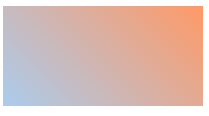
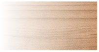

#css笔记（1）--Background

* [background-image](#background-image)
* [background-repeat](#background-repeat)
* [background-position](#background-position)
* [background-size](#background-size)
* [background-clip](#background-clip)

最近在百度前端学院上学习，仿着别人做了一个鼠标模糊效果，其中涉及到background的一些内容，所以想自己做一下整理。

## background-image
background-image是CSS中用来为元素设置背景图像的，背景占据了元素的全部尺寸，包括了内边距和边框。
background-image是有多个值设置.

- 	`none`:无背景图
- 	`url`:使用地址路径指向背景图像
- 	`linear-gradient`:使用线性渐变创建背景图像
- 	`radial-gradient`:使用径向(放射性)渐变创建背景图像
- 	`repeating-linear-gradient`:使用重复的线性渐变创建背景图像
- 	`repeating-radial-gradient`：使用重复的径向(放射性)渐变创建背景图像。

### - linear-gradient
linear-gradient线性渐变，背景图像沿着一个方向进行渐变。
linear-gradient怎么使用呢？

语法：
`
liner-gradient([<angle> || <point>,]? <color-stop>, <color-stop> [, <color-stop>]*)	
`

`angle`或者`point`指的是线性渐变的方向，color是渐变的颜色，最少为两个,为起点和终点颜色。
当没有给`color-stop`指定位置，则根据颜色数量平均分配
指定位置应在`color的后面，如 red 20%, blue 60%, green 100%.

**例子1:**

`
background: -webkit-linear-gradient(top, #ace, #f96);
`
`
background: -webkit-linear-gradient(left, #ace, #f96, #ace);
`

解释：top指定是一开始的方位，从上向下进行颜色渐变。同理left指的的从左向右进行颜色渐变。

**例子2：**

`
background: -webkit-linear-gradient(45deg, #ace, #f96);
`

解释：指定的角度它是一个由水平线与渐变线产生的的角度，逆时针方向。因此，使用0deg将产生一个左到右横向梯度，而90度将创建一个从底部到顶部的垂直渐变。

**例子3：**
`
background-image: -webkit-linear-gradient(right, rgba(255,255,255,0), rgba(255,255,255,1)),url(1.jpg);
`

解释：可以用颜色渐变和背景图片结合一起，这里显示效果相当于背景图片上有一层透明效果。

**引申**-可以同时有多个背景图像同时在元素中展示出来，使用

`
background-image: url(1.jpg), url(2.jpg);
`

多个url之间使用逗号隔开

## background-repeat
`background-repeat`属性规定是否及如何重复背景图像(平铺模式)，默认地，背景图像在水平和垂直方向上重复。
`background-repeat`有多个值设置

- repeat:默认，背景图像在水平和垂直方向上重复。
- repeat-x: 背景图像在水平方向上重复
- repeat-y: 背景图像在垂直方向上重复
- no-repeat: 背景图像不重复，就显示一次
- inherit: 背景图像从父元素继承该值的属性值

## background-position
`background-position`属性规定了背景图像的相对起始位置，它的取值可以是特殊字符值(top|left|right|bottom)，百分比(%)和长度单位(px,em...)

可以设置两个值，第一个是水平位置，第二个是垂直位置。如果只规定了第一个值，那么第二个自动设置为50%|center。

- **长度单位**
 
它是以图片的左上角为基准计算其相对位置的。

怎么说呢？背景图片将要放置的地方作为一个坐标系，左上角为坐标原点。向右向下为x、y轴正方向。

如果设置`background-position: 50px 50px`,则图片的左上角在坐标系上的(50,50)处，以该点为起始点放置图片。

- **百分比**

它是以图片的中心点为基准计算其相对位置的,但是其中心点又是不断在变的。

什么意思？比如设置`background-position: 50% 20%`,则图片的中心点为(50%,20%),这个点与坐标系的(50%,20%)相对应放置图片。

图片的左上角为0%，0%;右下角为100%, 100%。

- **特殊字符值**

可以设置为 top left right center这些值，当两个值都出现的时候，是以跟**百分比**一样的方式计算相对位置的。

在W3C中给出这样的例子

>top left and left top Same as ‘0% 0%’. 
top, top center, and center top Same as ‘50% 0%’. 
right top and top right Same as ‘100% 0%’. 
left, left center, and center left Same as ‘0% 50%’. 
center and center center Same as ‘50% 50%’. 
right, right center, and center right Same as ‘100% 50%’. 
bottom left and left bottom Same as ‘0% 100%’. 
bottom, bottom center, and center bottom Same as ‘50% 100%’. 
bottom right and right bottom Same as ‘100% 100%’. 

## background-size
　　`background-size`设置了背景图片的原始高度和宽度。
它可以取值为像素值，百分比或者其他字符段。
当background-size取值为number和percentage时可以设置两个值，也可以设置一个值，当只取一个值时，第二个值相当于auto，但这里的auto并不会使背景图片的高度保持自己原始高度，而会与第一个值相同。

- `auto` 此值为默认值，保持了背景图片的原始高度和宽度
- `number` 设置为具体的值。
- `percentage` 此值为百分值，可以是0%〜100%之间任何值，但此值只能应用在块元素上，所设置百分值将使用背景图片大小根据所在元素的宽度的百分比来计算。
- `cover` 此值是将图片放大，以适合铺满整个容器，这个主要运用在，当图片小于容器时，又无法使用background-repeat来实现时，我们就可以采用cover;将背景图片放大到适合容器的大小，但这种方法会使用背景图片失真;
- `contain` 此值刚好与cover相反，其主要是将背景图片缩小，以适合铺满整个容器，这个主要运用在，当背景图片大于元素容器时，而又需要将背景图片全部显示出来，此时我们就可以使用contain将图片缩小到适合容器大小为止，这种方法同样会使用图片失真。

## background-clip
`background-clip`是进行背景裁剪，将超出区域外的背景给剪掉
	它可以有多个值设置。

- `border-box`: 此值为默认值，背景从border区域向外裁剪，也就是超出部分将被裁剪掉;
- `padding-box`:背景从padding区域向外裁剪，超过padding区域的背景将被裁剪掉;
- `content-box`: 背景从content区域向外裁剪，超过context区域的背景将被裁剪掉;
- `text`: 文本裁剪，超出文本的背景将被裁剪掉
- `no-clip`: 背景从border区域向外裁剪背景。

